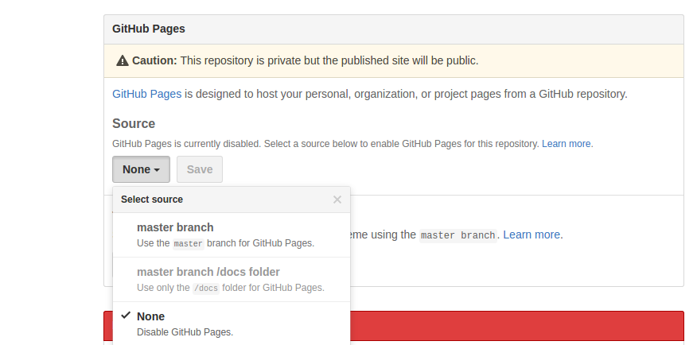

### Creación de una gh-page
Suponiendo que tenemos un código correspondiente a una página web, para incluirlo en una gh-page se puede hacer de varias maneras:

* **Mediante Interfaz Gráfica**:
Github proporciona por cada repositorio una opción en la que indicamos la activación de una gh-page y hacia que rama queremos que apunte.

<div style="text-align:center"></div>

* **Mediante la creación directa de una rama gh-pages**:
Otra manera de publicar directamente una gh-page es crear una rama llamada **gh-pages** en la que alojemos ahí nuestro código de la página web.

<div style="text-align:center"></div>

  Creación de la rama *gh-pages* en el repo local, donde colocaremos todos los archivos perteneciente a la website que queremos alojar:

  ```
  git branch gh-pages
  ```

  Nos posicionamos localmente en la rama gh-pages creada, y subimos ahora directamente todos los archivos de esa rama, a la rama gh-pages del repo remoto, si no está creada, la crea automáticamente:

  ```
  git push origin gh-pages
  ```


