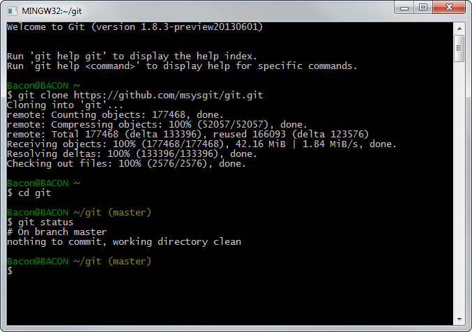

### Instalación de Git

#### Instalación de Git en Ubuntu
Para proceder a su instalación bastará con teclear el siguiente comando en la terminal, el cual se encargará de buscar dicho paquete entre los repositorios que ofrece Ubuntu para instalarlo.

```
$ sudo apt-get install git
```

#### Instalación de Git en Windows
En el caso de Windows, para su instalación primero se deberá visitar la siguiente página web ([Aquí](https://git-for-windows.github.io/)) y descargar el software de instalación que ofrece.

<div style="text-align:center"></div>

Tras su instalación estará a nuestra disposición una versión de git a través de una shell como también mediante una interfaz gráfica.

* Version Bash

<div style="text-align:center"></div>

* Version GUI

<div style="text-align:center"></div>
