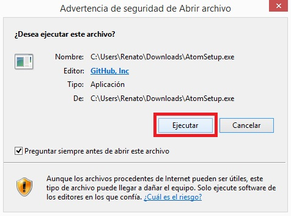

### Instalar Atom en Windows

Podemos encontrar el instalador del editor Atom en el siguiente link:
[Atom](https://atom.io/)  
* Podrán encontrar un botón de descarga "Download Windows Installer".

  

* Una vez que hayamos descargado el programa ejecutamos el instalador.

  

El instalador tardará unos cuantos minutos para descargarse y tendremos listo el programa
