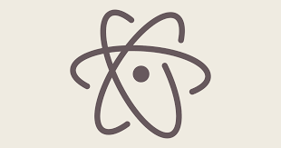
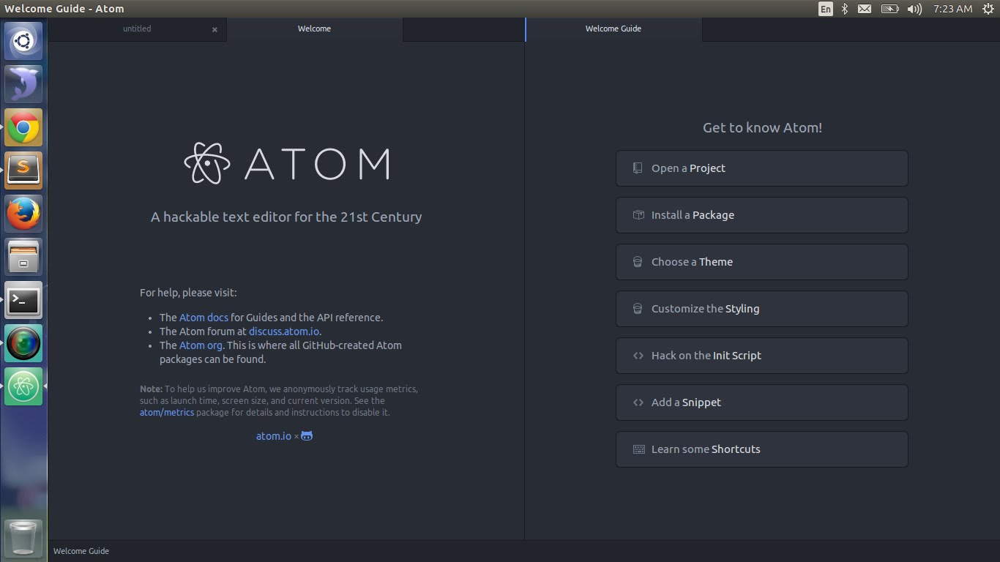

# Atom

### ¿Qué es Atom?
Atom es un editor de código de fuente abierta para macOS, Linux, y Windows con soporte para plug-ins escrito en Node.js, Incrustando Git Control, desarrollado por GitHub. Es una aplicacion de escritorio construida utilizando tecnologias web. Está basado en Electrón (Anteriormente conocido como Atom Shell),Un framework que permite aplicaciones de escritorio multiplataforma usando Chromium y Node.js. También puede ser utilizado como un entorno de desarrollo integrado (IDE), Atom libero su beta en la versión 1.0,  Sus desarrolladores lo llaman un "Editor de textos hackable para el siglo XXI".

