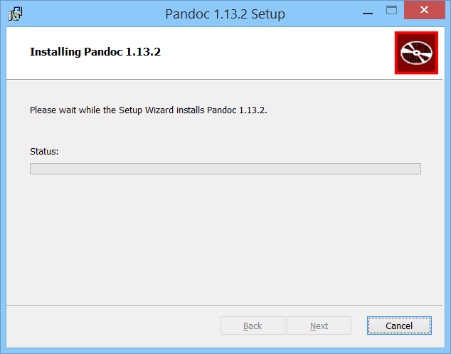

### **Instalación de Pandoc en Windows**

* Paso 1. Descargar el programa desde [aquí](https://github.com/jgm/pandoc/releases/tag/1.19.2.1)

* Para la generacion de PDF recomendamos [Miktex](https://miktex.org/download)

  

* Paso 2. Cuando esté Pandoc instalado, debemos añadirlo a las variables de entorno de Windows, ya que si no lo hacemos, Sublime Text no podrá ejecutar el comando. Para ello, vamos a la configuración avanzada del sistema:

  

*  Paso 3. Se abrirá una ventana y tenéis que hacer click en "Variables de entorno":

  

* Paso 4. Ahora tenéis que copiar como texto (click derecho, "copiar como texti") la ruta del directorio de instalación de Pandoc:

  

* Paso 5. La dirección que habeis copiado la teneis que introducir en la variable **Path**

  

Una vez llegueis a este punto, todo **listo**.
